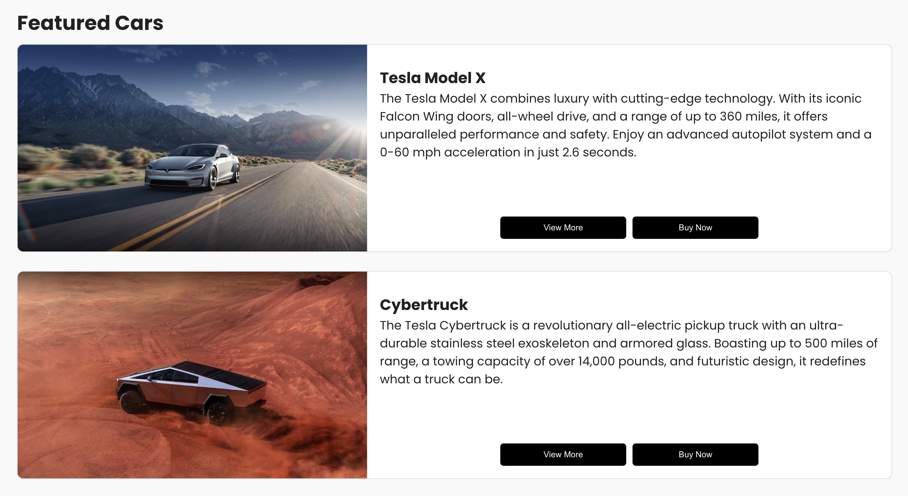
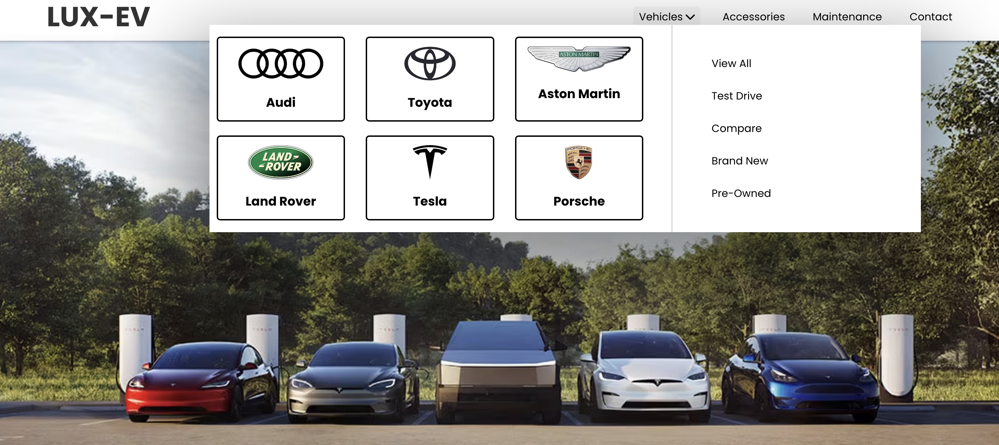
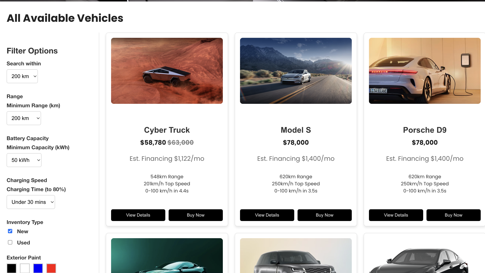
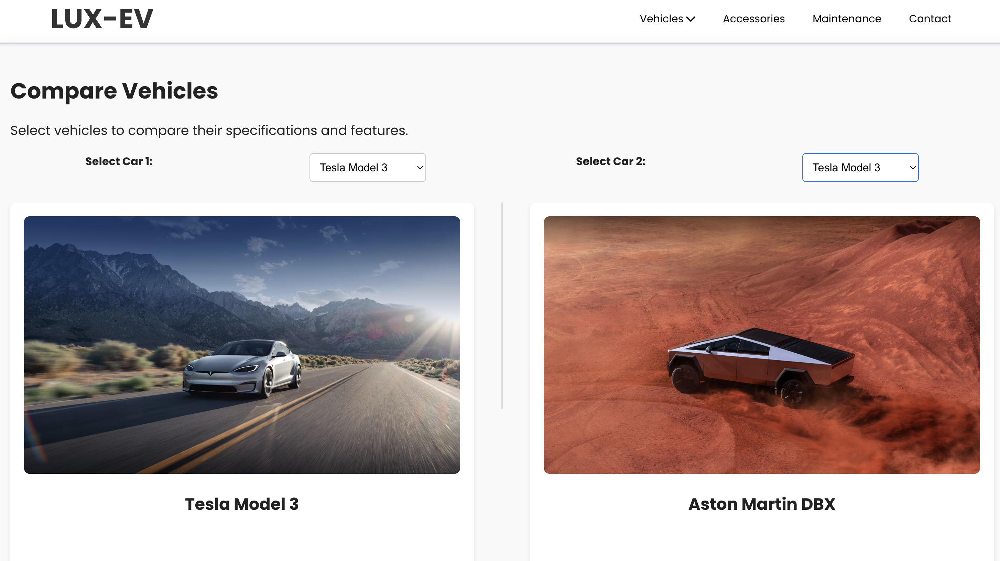
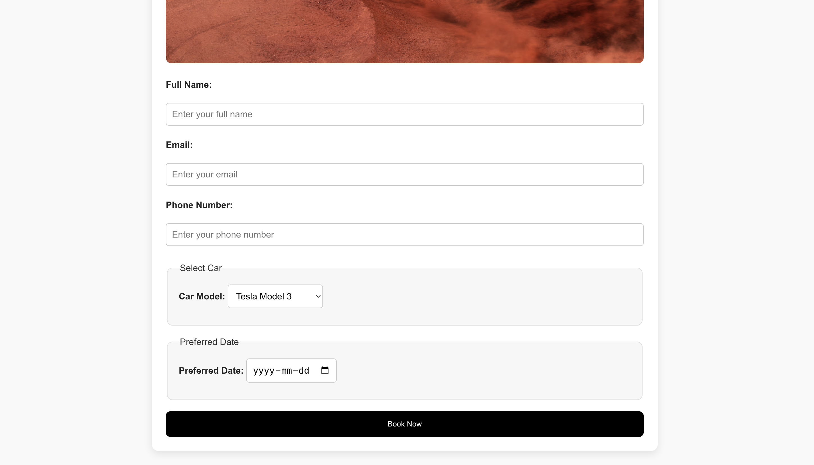
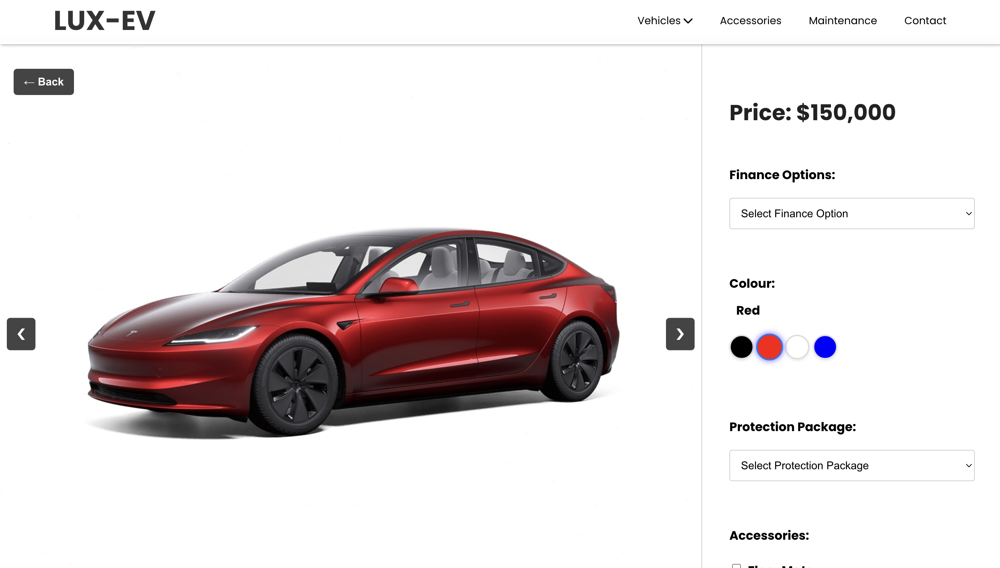
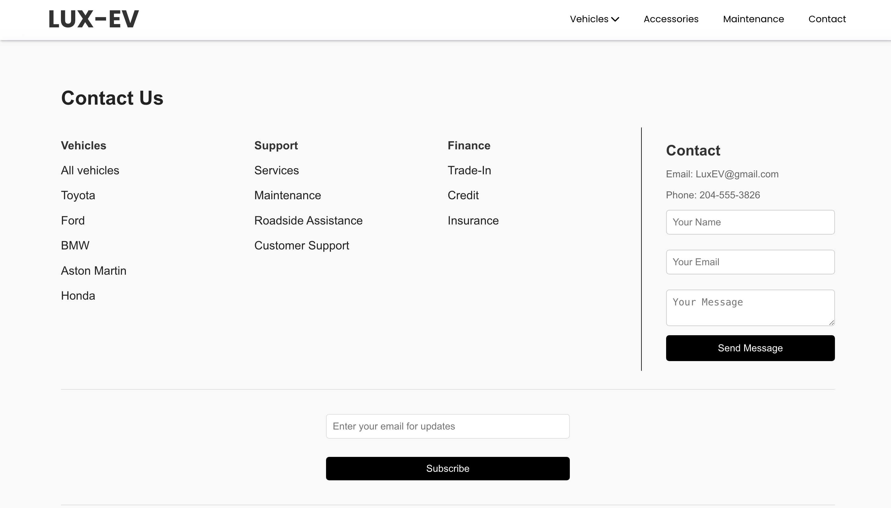
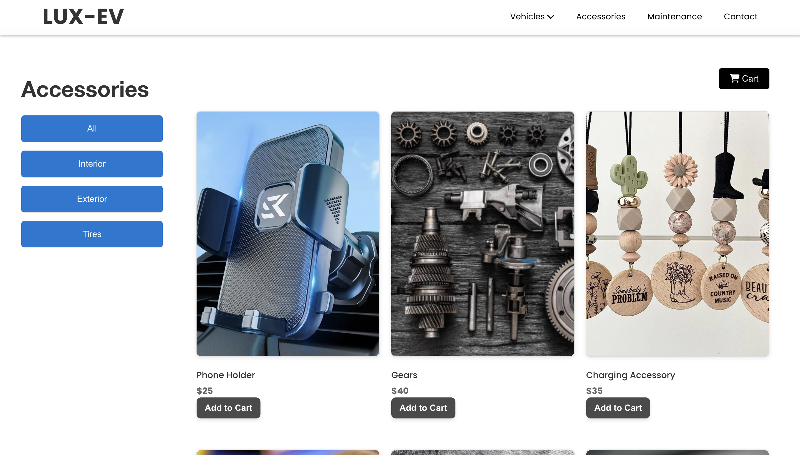

# **EV Cars E-commerce Website Prototype**  
This project was developed as part of the coursework for a Human-Computer Interaction (HCI) course. It showcases a **Luxury Electric Vehicle E-commerce Website** through a vertical prototype.

---

## **Introduction**  
The project aims to enhance user experience and interface design following HCI principles and user requirements.  

- The process began with **user research**, including interviews with participants from diverse age groups, genders and varying knowledge levels in the domain.  
- Based on the findings, rough sketches of the interface were created, followed by a **horizontal storyboard** as a low-fidelity prototype.  
- Feedback was gathered through subsequent interviews to align the design with user expectations and requirements.  
- The final vertical prototype was implemented using **HTML**, **CSS**, **JavaScript**, and relevant libraries.  

---

## **How to Run the Project**  

1. **Locate the Project Folder**  
   Ensure you have the project folder available on your system.  

2. **Navigate to the `Dist` Folder**  
   Inside the project folder, you will find three subfolders: `Src`, `Dist`, and `node_modules`.  
   - Open the `Dist` folder.

3. **Open `index.html`**  
   - To view the prototype, locate the `index.html` file inside the `Dist` folder.  
   - You can open it using one of the following methods:  
     - **Right-click** on `index.html` and select **Open With** → **Chrome** (latest version).  
     - **Double-click** the file if Chrome is set as your default browser.  

---
## **Sample Images**

### **Homepage**

### **Featured Cars on Homepage**

### **Dropdown Menu**

### **'View All' Vehicles Page**

### **Compare Vehicles**

### **Test Drive Booking**

### **Checkout**

### **Contact Page**

### **Accessories Page**

\
\
## Group Members
[Shiv Gandhi](https://github.com/Shivv10) \
[Andrew Iheanacho](https://github.com/Andrew-Ih) \
[Chineze Obi](https://github.com/Chineze-prog) \
[Mohamed Youssef]()
